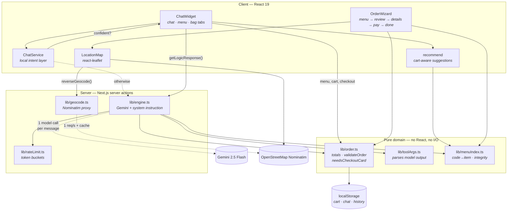

# 🍽️ SeasonBot — Conversational Dining System

**A conversational waiter for a real restaurant.** A customer opens a chat, asks for *"two grilled chicken and a cold drink"*, and gets a validated order with delivery eligibility and a receipt — or a floating widget embedded in someone else's website.

Built for **Four Season Restaurant, Dhanmondi, Dhaka** (X-group). Next.js 16 · React 19 · TypeScript (strict) · Gemini 2.5 Flash tool-calling · Leaflet · Tailwind v4.

[](https://nextjs.org)
[](https://react.dev)
[](https://www.typescriptlang.org)
[](https://tailwindcss.com)
[](https://vitest.dev)
[](LICENSE)

---

## The problem

Small restaurants take orders over the phone. That means missed calls during the dinner rush,
people quoting card numbers aloud, and staff repeating the same questions — *"what's your
number? where are you? are you sure you can eat that?"* — on every single order.

A chatbot is the obvious answer, and most restaurant chatbots are bad: they can't add anything
to a basket, they ignore the delivery radius, and they cheerfully "confirm" an order the kitchen
can't fulfil. **The interesting part of this project is not the chat — it's everything that has
to be true before the chat is allowed to confirm an order.**

---

## What makes it interesting

**1. The model gets six verbs and a validation layer, not the keys to the kingdom.**
The AI can only express intent through one `manage_order` tool. Everything it emits is parsed
and repaired server-side before a single line changes: a hallucinated item code is dropped and
reported back to the customer, a negative quantity is clamped, and an invented category falls
back to the full menu instead of rendering a blank tab. The model is treated as an **untrusted
input source** — see [`lib/toolArgs.ts`](lib/toolArgs.ts).

**2. The server owns the business rules, so a prompt injection cannot place an invalid order.**
The model asking to `confirm` is a *request*, not a command. The order is re-validated on the
server with the same pure function the checkout form uses ([`lib/order.ts`](lib/order.ts)) — and
because `locationVerified` is only ever set by the map, a guest cannot talk their way past the
5 km delivery radius with a convincing sentence.

**3. Recommendations that cost nothing.**
A conventional implementation asks the LLM "what goes with this?" on every basket change — the
single most frequent AI call in an ordering flow. [`lib/recommend.ts`](lib/recommend.ts) does it
deterministically instead: pair a cold drink with a spicy main, prioritise the *"৳660 more and
delivery is on us"* nudge, never suggest something already ordered, and never suggest prawn to
a guest who said they're allergic. **Zero API calls, instant, testable** — and it keeps working
in demo mode with no API key.

**4. It degrades instead of breaking.**
No API key, an exhausted quota, a 429, a timeout, a missing menu item — each is a distinct,
typed error surfaced through `AIResponse.meta`. A visitor without a key gets a fully working menu,
cart, map and checkout with a labelled "AI temporarily unavailable" banner. **It degrades; it never
white-screens.**

**5. It gives the keys back on close.**
Focus returns to the button that opened the widget. Escape walks out. The chat log is an ARIA
live region, pinch-zoom is not disabled, and `prefers-reduced-motion` is respected. A widget
embedded in a third-party iframe does *not* steal focus on load.

---

## Architecture



**Data flow for one message:**

```
guest message
  → ChatService.checkStaticIntent()      confident? → instant reply, 0 API calls
  → getLogicResponse()  [server action]
       → rate limiter (per client / per instance / daily budget)
       → Gemini: system instruction (menu + cart + remembered preferences) + tool schema
       → parseManageOrderArgs()           drop / clamp / repair the model's request
       → validateOrder()                  refuse an invalid `confirm`, ask for what is missing
  → processOrderAction()                  apply to the cart, toast, suggest
  → suggestForCart()                      local, deterministic, free
```

### Project layout

```
lib/                     the domain — all pure, all tested
  order.ts               totals, business rules, checkout hand-off
  placeOrder.ts          re-prices an untrusted order payload      ["use server"]
  toolArgs.ts            runtime validation of model output
  engine.ts              Gemini call, system instruction, confirm gate  ["use server"]
  prompt.ts              the system instruction, as pure functions
  menuPayload.ts         compact menu serialisation for the prompt
  rateLimit.ts           in-memory token buckets
  hours.ts               seasonal opening hours
  recommend.ts           cart-aware suggestions
  menuIndex.ts           code→item index, menu integrity checks
  chatService.ts         local intent layer + reorder
  geocode.ts             Nominatim proxy (throttled + cached)          ["use server"]
  telegram/              kitchen notification (server-only)
  constants.ts           restaurant + menu data, business rules
  types.ts               every interface
  hooks/                 useCart · useChat · useFocusTrap · useNow
components/
  ChatWidget.tsx         the widget shell: cards, voice, quick replies, a11y
  chat/OrderCards.tsx    menu, basket, checkout and confirm cards
  site/                  the public pages: header, hero, sections, footer
  wizard/                MenuItemCard · LocationMap
app/
  page.tsx               the restaurant page (server component) + widget
  embed/page.tsx         full-screen widget for iframe embedding
  not-found.tsx          404
  robots.ts · sitemap.ts
  api/chat/              the waiter, behind the Gemini key
  api/place-order/       prices and validates an order, then notifies
  error.tsx              route error boundary
  global-error.tsx       last-resort boundary
public/embed.js          drop-in script for third-party sites
types/webspeech.d.ts     minimal Web Speech API typings
```

---

## Getting started

**Requirements:** Node.js **>= 20.9** (Next.js 16's own minimum) and a Gemini API key — or neither, see below.

```bash
git clone https://github.com/AJAmran/x-bot.git
cd x-bot
npm install
cp .env.example .env.local     # add your GEMINI_API_KEY (optional)
npm run dev                    # http://localhost:3000
```

| Route | What it is |
|---|---|
| `/` | The restaurant page, with the chat widget |
| `/embed` | Full-screen widget, designed to be iframed |

### Embedding it on another site

```html
<script src="https://your-domain.com/embed.js"></script>
```

`public/embed.js` injects a floating trigger and a 420×720 iframe. It reads its own `src` to find
the bot's origin, so the tag works from any domain. `/embed` is the only route that may be framed
by another site; everything else sends `X-Frame-Options: SAMEORIGIN`.

### Scripts

| Command | What it does |
|---|---|
| `npm run dev` | Dev server (Turbopack) |
| `npm run build` | Production build |
| `npm start` | Serve the production build |
| `npm run lint` | ESLint — currently **0 errors, 0 warnings** |
| `npm run typecheck` | `tsc --noEmit` — **0 errors** under `strict` |
| `npm test` | Vitest — **365 tests, ~0.5 s** |

**No API key? The app still works.** Menu, cart, map, checkout, cash on delivery, the local intent layer
and cart-aware suggestions all run. Only the conversational waiter is unavailable, and the chat
says so. This is deliberate: it makes the deployed demo safe to share without leaking a key.

---

## Accessibility

Not an afterthought — the widget is a keyboard-and-screen-reader-first surface.

- Chat log is a `role="log"` **live region**, so replies are actually announced
- Real `tablist` / `tab` / `tabpanel` semantics with a roving tabindex
- A visible `:focus-visible` ring on every interactive element
- Focus moves into the panel on open and **returns to the opener** on close; Escape walks out
- Pinch-zoom is **not** disabled (the original `userScalable: false` was a WCAG 2.1 AA failure)
- `prefers-reduced-motion` neutralises every ping / pulse / bounce / scale animation
- 9px micro-labels were failing contrast at ~2.6:1; they now pass AA
- Icon-only controls have accessible names; the order-reference copy control is a real `<button>`
- The iframe embed does not steal focus from the host page

---

## Project decisions worth defending

**Pure domain, thin components.** Every rule that matters — totals, minimums, radius, phone
format, opening hours, model-output validation — lives in `lib/` with no React and no I/O. That is why the
suite is 365 tests in well under a second with **no jsdom and no testing library**, and why the
same function can gate a form submission and a server action.

**Fail loudly on bad data.** Duplicate item codes silently made nine dishes unorderable and merged
others into one basket line. That is fixed *and* guarded: `findDuplicateCodes()` is asserted empty
in the test suite so it cannot regress.

**Cheap wins that are actually load-bearing.** A local intent layer absorbs navigation questions
before they cost an API call; `mentionsMenuItem()` decides "is this an order?" from the menu data
rather than keyword lists, which is what stopped the bot answering *"time to order the sizzling
beef"* with opening hours.

**One number, one place.** The delivery minimum, radius, fee and method list are declared once in
[`lib/constants.ts`](lib/constants.ts) and interpolated into the system instruction, the checkout
copy and the validation logic — so the waiter, the UI and the model cannot disagree.

---

## Known limitations & roadmap

Stated plainly, because a project that pretends to be finished reads worse than one that isn't.

### Deliberately out of scope
- **No database.** The transcript and order history live in `localStorage`, so order history is
  per-device. What the kitchen receives is the Telegram notification, not a queue. *Next:* Postgres
  + Prisma, a read-only `/admin` view, and a webhook into the existing `foodbitebd` platform.
- **Payment is cash on delivery.** No PSP, no card form, no simulated gateway: the order is placed
  with `paymentMethod: 'cod'` and `paymentStatus: 'pending'`, and the money changes hands with the
  rider. Nothing is collected or stored, so there is no payment data to protect. *If a card method
  is ever added it must be authorised server-side and marked paid only on a real gateway response.*
- **The order is still placed from the browser.** `POST /api/place-order` re-prices every line from
  the server's own copy of the menu, clamps quantities, re-derives totals and runs the same
  `validateOrder` the UI uses, so a modified client cannot change what a dish costs or slip past a
  business rule — but it can still choose *which* dishes to order, and there is no account to tie
  an order to a person. *Next:* place the order from an authenticated server action.
- **The kitchen endpoint is rate-limited, not authenticated.** It takes a same-origin check and a
  per-address bucket (`consumeNotifyQuota`, 3 then 1/min, kept separate from the AI quota so
  notification spam cannot take the chat offline). A determined caller can still forge a valid order
  and get a message into the kitchen chat.
- **No authentication, no admin panel.** *Next:* magic-link auth and a read-only kitchen view.

- **Allergen handling is partial.** The menu carries only `S / N / H / V / D` tags, so a stated
  allergy is honoured against those (`recommend.ts` maps "allergic to prawns" → skip `S`). There is
  no full allergen or cross-contamination matrix, so **do not rely on this for a real allergy**.
  *Next:* an allergen table per dish, and a hard block at checkout rather than a filtered suggestion.

### Free-tier constraints this was designed around
- **Gemini free tier is the binding limit.** Google's docs publish the *mechanism* (per-project
  RPM / input-TPM / RPD, 429 on breach) but not a static per-model table — check your own quota in
  **AI Studio → Rate Limit page**. `RATE_LIMITS` in [`lib/rateLimit.ts`](lib/rateLimit.ts) is set
  from a secondary source (≈10 RPM / 250 RPD) and its daily budget (180) is deliberately *below*
  that, so the app degrades before Google starts returning 429s to visitors. **Tune these three
  numbers to your real quota.**
- **The prompt is large.** The full 239-item menu is ~51 KB ≈ **13,000 tokens on every call**.
  Gemini **context caching is not available on the free tier**, so the only lever is sending less:
  dropping descriptions cuts it to ~34 KB (−49%) at the cost of menu Q&A quality. *Next:* a compact
  code/price digest for turns that do not need descriptions.
- **Request cancelling is client-side only.** `AbortController` stops us waiting, but Google
  still processes the request, so a timed-out call can still consume quota. Budgeted for.
- **`GEMINI_API_KEY` is read at build time** because the pages are statically prerendered. Change
  it on Vercel and you must **redeploy**, not just restart.
- **The rate limiter is in-memory**, so it is per-instance and resets on cold start. It stops one
  visitor hammering the endpoint (Next.js already blocks cross-origin server actions); it is not a
  distributed quota. *Next, only if traffic justifies it:* Upstash Redis or Vercel KV.
- **OpenStreetMap tile policy.** Their public tile server is fine at demo scale but is not for
  real traffic, and the geocoding proxy is capped at 1 req/s with a 10-minute cache as their policy
  requires. *Next if it grows:* a self-hosted tile style or a keyed provider.

### Smaller things
- Voice input is **Chromium-only** (Web Speech API). The mic is feature-detected and disabled with
  an explanation elsewhere.
- `embed.js` targets desktop and mobile but does not yet post height back to the host page, so an
  iframe embed cannot auto-resize. It also uses a same-origin assumption for the widget URL.
- The beverage menu contains five dishes listed twice at different prices (`365`/`902` and
  friends) — a data issue in the source menu, not deduplicated here because choosing a price is the
  restaurant's call.
- **Nine item codes were changed** (`150`–`158` were each shared by two different dishes; variants
  are now `150a`…`158a`). This is a data correction and should be **confirmed with the restaurant**
  before this reaches their POS.

---

## Free services this project depends on

Every one of these is free at this scale, with no card and no paid add-ons.

| Service | Used for | Free tier / limit | Risk at demo scale |
|---|---|---|---|
| **Vercel Hobby** | Hosting, server actions, image optimisation | 1M edge requests/mo; functions max 300 s (our model budget is 20 s) | None — a few dozen visitors/day is far below |
| **Google Gemini API** | The conversational waiter | Free tier, per-project RPM/TPM/RPD. **Verify your quota in AI Studio** | ⚠️ The real constraint — handled by the limiter, the local intent layer, and demo mode |
| **OpenStreetMap tiles** | Map tiles | Free, fair-use policy, no SLA | Low — a demo is not "meaningful" traffic |
| **Nominatim** | Reverse geocoding | Free, **max 1 req/s**, requires an identifying User-Agent | Low — proxied server-side, throttled and cached |
| **Google Fonts** (Outfit) | UI typeface | `next/font` self-hosts at build time — **no runtime calls to Google** | None |
| **Unsplash** | ~10 menu photos | Free, hot-linked through the Vercel image optimiser | None |
| **GitHub Actions** | CI (lint + typecheck + test + build) | Free on public repos, 2,000 min/mo | None |

No paid database, no Redis, no error-tracking service, no paid fonts, no monitoring SaaS.

---

## Testing

```
npm test        # 365 tests across 12 files, ~0.5s, node environment
```

The suite covers the parts that would actually hurt if they broke: BD phone formats, the ৳1000
delivery minimum, the 5 km radius at its exact boundary, tampered totals, hostile model output
(negative quantities, invented codes, `[[[[[1]]]]]`), the local intent boundary between navigation
and ordering, the opening-hours logic, the rate limiter's refill and daily reset, and the recommendation rules
including dietary filtering.

It is mutation-checked: changing the radius comparison from `>` to `>=` fails the suite.

---

## Accessibility & performance notes

See [Accessibility](#accessibility) above. On performance: the menu index, the distinctive-token
set and the menu prompt payload are each built **once per module load** rather than per render;
menu search is wrapped in `useDeferredValue`; the wizard and the map are dynamically imported with
`ssr: false`; and the client bundle contains no `any` and no abandoned dependencies.

---

## Contributing

Issues and PRs welcome. Please run `npm run lint && npm run typecheck && npm test` first — CI
runs the same three gates plus a production build.

## License

[MIT](LICENSE) © 2026 AJAmran

---

#
